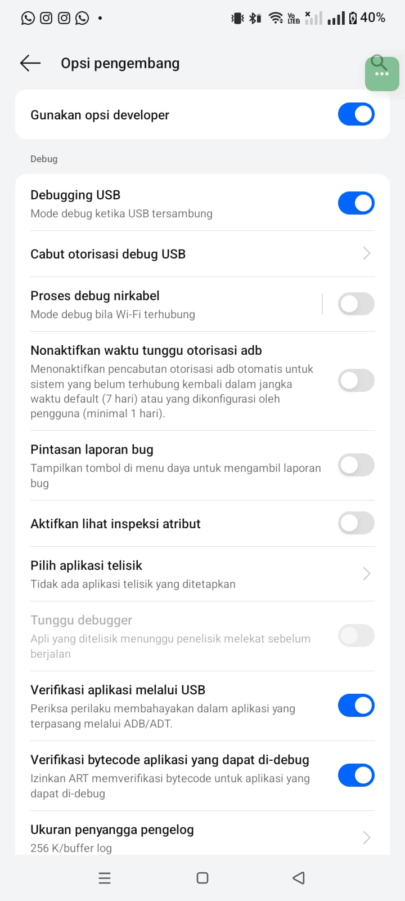

## Jobsheet 1: Ekosistem mobile dan Flutter

**Nama:** Nur Alfiyanti  
**NIM:** 244107020055 - 17  
**Kelas:** TI-3E  

### Langkah-langkah beserta bukti Screenshoot:

## LAPORAN PRAKTIKUM WEEK01

<h3>4. Menyiapkan environment</h3>

 
<blockquote>

## Ringkasan

Pada jobsheet ini dilakukan instalasi dan verifikasi environment pengembangan aplikasi Flutter, mulai dari instalasi Git, VS Code, Flutter SDK, hingga Android Studio beserta Android SDK. Proses ini juga mencakup penyelesaian beberapa kendala teknis yang muncul selama instalasi (dijelaskan pada bagian Troubleshooting).

---

## Langkah Praktikum :

### 1. Instalasi Git
Instal Git dari git-scm.com, dan Git sudah terpasang sejak semester sebelumnya, sehingga pada jobsheet ini hanya dilakukan verifikasi ulang dengan perintah:'git --version'  
  

### 2. VS Code dan Ekstensi Flutter
VS Code beserta ekstensi Flutter juga sudah terpasang sejak semester sebelumnya. Ekstensi dipastikan masih aktif dan berfungsi normal untuk mendukung pengembangan Flutter.  
  

### 3. Instalasi Flutter SDK
Flutter SDK diinstal mengikuti panduan resmi, kemudian folder flutter/bin ditambahkan ke PATH melalui Environment Variables. Karena penyimpanan drive C: terbatas, seluruh instalasi (Flutter SDK, Android SDK, gradle cache, temp folder) dipindahkan ke drive D:  
  
  

#### flutter --version
  

### 4. Instalasi Android Studio, Android SDK, Command-line Tools, dan Emulator
Android Studio diinstal beserta Android SDK, Command-line Tools, dan emulator melalui SDK Manager dan Device Manager, dengan lokasi SDK diarahkan ke D:\Android\sdk.  

## Konfigurasi Android Studio
  
  
  
  
  
  
   
  
  
  
  
  
  
  
  
  

### 5. Verifikasi Instalasi

#### flutter doctor
  

#### Setting PATH
  

Setelah setting PATH:  
  

#### flutter doctor Setelah Setting PATH 
  

#### flutter doctor --android-licenses
  
  

#### flutter doctor --v
  

</blockquote>

 

<h3>5. Praktikum: aplikasi Flutter pertama</h3>

 
<blockquote>

## Langkah Praktikum

### 1. Membuat Proyek Flutter
  

### 2. Membuat Repo di GitHub dan README.md
  
.png>) 
  
  

### 3. Git Pull Repo
  

### 4. Mengaktifkan Developer Options dan USB Debugging
Pada perangkat Android (HP), Developer Options diaktifkan melalui Settings > About Phone > tap Build Number sebanyak 7 kali, kemudian USB Debugging diaktifkan pada menu Developer Options.  

### 5. Menghubungkan Perangkat
HP dihubungkan ke laptop menggunakan kabel data, kemudian dialog otorisasi USB debugging yang muncul di HP diizinkan (Allow).  
  
  

### 6. Verifikasi Perangkat Terdeteksi (`flutter devices`) 
Perangkat RMX3938 berhasil terdeteksi sebagai target Android.  
  

### 7. Menjalankan Aplikasi (`flutter run`)
Aplikasi berhasil di-build dan berjalan (debug mode) langsung pada perangkat fisik.  
  

#### Tampilan Kode Setelah Run
  

#### Tampilan Setelah Run di Mobile
  

## 8. Hasil Run Setelah Diedit 
### Code
  
### Mobile
.jpeg>)  

</blockquote>

 

<h3>6. Verifikasi, Tugas, dan Refleksi</h3>

 
<blockquote>

## Verifikasi
- [x] `flutter doctor` tidak memiliki masalah yang menghambat target Android
- [x] `flutter devices` mendeteksi perangkat fisik (RMX3938)
- [x] Aplikasi berjalan dan UI default telah diganti dengan profil sederhana
- [x] Dapat menjelaskan perbedaan hot reload dan hot restart
- [x] Repository remote berisi source code, README, screenshot, dan riwayat commit

## Tugas
Aplikasi **Profil Mahasiswa** dibuat menggunakan widget dasar `CircleAvatar`, `Icon`, `Text`, dan `Column`, menampilkan foto profil berbentuk lingkaran, nama, NIM, kelas, nama kampus, dan keterangan mata kuliah.
### Kode 
  

### Hasil Run 
  

## Refleksi

**1. Kapan *native* lebih tepat dipilih daripada *cross-platform*?**

*Native* lebih tepat dipilih apabila aplikasi membutuhkan kinerja maksimal atau akses langsung ke fitur perangkat yang spesifik dan mendalam, misalnya pemrosesan sensor kamera tingkat lanjut, *AR/VR*, atau integrasi API sistem operasi terbaru yang belum tentu tersedia pada kerangka kerja (*framework*) *cross-platform*. *Native* juga lebih tepat apabila aplikasi hanya menyasar satu *platform* saja, sehingga tidak ada kebutuhan efisiensi lintas *platform*, atau apabila tim pengembang memang sudah memiliki keahlian khusus pada Kotlin/Swift dan proyek menuntut kualitas antarmuka pengguna yang benar-benar menyatu dengan konvensi *platform* tersebut.

**2. Bagaimana perubahan *state* berhubungan dengan *widget tree* dan antarmuka pengguna deklaratif?**

Pada Flutter, antarmuka pengguna bersifat deklaratif, artinya tampilan yang muncul di layar merupakan hasil langsung dari *state* saat itu, bukan dimanipulasi langkah demi langkah seperti pada pendekatan imperatif. Ketika *state* berubah (misalnya melalui `setState()`), Flutter membangun ulang (*rebuild*) bagian *widget tree* yang bergantung pada *state* tersebut, lalu membandingkannya dengan tampilan sebelumnya untuk menentukan bagian mana saja yang perlu diperbarui di layar. Oleh karena itu, saat melakukan *hot reload*, Flutter dapat menyisipkan kode baru ke *widget tree* yang sudah berjalan tanpa membangun ulang seluruh *state* dari awal, sedangkan *hot restart* membangun ulang seluruh *widget tree* beserta *state*-nya dari nol.

**3. Mengapa *commit* kecil dengan pesan yang jelas bermanfaat bagi pekerjaan tim dan portofolio?**

*Commit* kecil dengan pesan yang jelas memudahkan penelusuran riwayat perubahan, karena setiap *commit* hanya mewakili satu perubahan spesifik sehingga lebih mudah dipahami, ditinjau (*review*), atau dikembalikan ke versi sebelumnya (*rollback*) apabila terjadi kesalahan, tanpa memengaruhi perubahan lain yang tidak berkaitan. Bagi kerja tim, hal ini mengurangi risiko konflik saat menggabungkan (*merge*) pekerjaan banyak orang, serta mempermudah proses peninjauan kode karena peninjau dapat berfokus pada perubahan yang kecil dan terarah. Untuk portofolio pribadi, riwayat *commit* yang rapi dan deskriptif juga menunjukkan proses berpikir dan konsistensi kerja dari waktu ke waktu, bukan hanya hasil akhirnya saja; hal ini menjadi nilai tambah ketika ditinjau oleh dosen atau calon pemberi kerja.

## Kesimpulan

Melalui praktikum ini, environment pengembangan Flutter (Flutter SDK, Android Studio, Android SDK, dan perangkat fisik untuk debugging) berhasil disiapkan dan diverifikasi.

<blockquote> 
