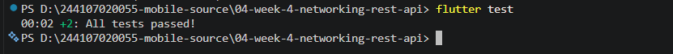
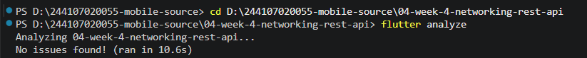

## Jobsheet 4: Networking & REST API

**Nama:** Nur Alfiyanti <br>
**NIM:** 244107020055 - 17 <br>
**Kelas:** TI-3E <br>

----

## Struktur Project
- `lib/` : kode aplikasi (data, models, repositories, pages)
- `test/` : unit dan widget test
- `docs/` : dokumentasi AI Challenge
- `screenshots/` : tangkapan layar hasil

## Cara Menjalankan
```bash
flutter pub get
flutter run
```
----

## LAPORAN PRAKTIKUM WEEK04

<details>
<summary><h3>2. Konsep HTTP, REST, dan JSON</h3></summary>
<br>
<blockquote>

## Ringkasan
HTTP adalah protokol *request–response*: client mengirim request (method + URL + header + body), server membalas dengan status code + body. REST adalah gaya arsitektur yang memetakan operasi ke *resource* melalui URL dan method HTTP (`GET` membaca data, `POST` membuat resource baru, `PUT`/`PATCH` mengganti/memperbarui, `DELETE` menghapus). Status code penting yang perlu disiapkan UI-nya: `200 OK`, `201 Created`, `400 Bad Request`, `401 Unauthorized`, `404 Not Found`, `500 Internal Server Error` — mencakup kelompok sukses (2xx), client error (4xx), dan server/network error (5xx/timeout).

JSON (*JavaScript Object Notation*) adalah format tukar data standar API. Data mentah JSON (`Map<String, dynamic>`) perlu dipetakan ke *class model* di Dart agar aman terhadap `null` dan kesalahan ketik — pola manual `fromJson`/`toJson` cukup untuk codelab ini, sementara untuk project besar biasanya dipakai *code generator* (`json_serializable`/`freezed`).

**Repository pattern dasar** (jembatan menuju Clean Architecture di minggu 7): UI tidak boleh memanggil Dio/http secara langsung — UI hanya membaca provider. *Repository* adalah satu-satunya pintu ke sumber data (API), mengubah exception jaringan menjadi kegagalan bermakna bagi UI. Provider Riverpod mengekspos `AsyncValue` ke UI (loading/error/data). <br>

---

</blockquote>
</details>

<br>

<details>
<summary><h3>3. Praktikum 1: Dio dan Model Data</h3></summary>
<br>
<blockquote>

## Ringkasan

Pada praktikum ini dibangun fondasi *networking* aplikasi: model data (`Post`) dengan parsing JSON yang aman terhadap `null`, konfigurasi `Dio` terpusat (base URL, timeout, logging), dan `PostRepository` sebagai satu-satunya pintu pengambilan data dari API [JSONPlaceholder](https://jsonplaceholder.typicode.com/) (`GET /posts`).

---

## Langkah Praktikum beserta Bukti Screenshoot

Siapkan project (`flutter create`, `flutter pub add dio flutter_riverpod`), susun struktur folder (`lib/data/models/`, `lib/data/repositories/`, `lib/pages/`): <br>
 <br>
 <br>

Struktur folder: <br>
 <br>

### 1. Model Data dengan `fromJson` Aman Null (`lib/data/models/post.dart`)
 <br>

Respons API nyata sering tidak sesuai dokumentasi (field hilang, tipe berubah). Pola `as String? ?? ''` mencegah crash `type 'Null' is not a subtype` yang menjadi sumber bug paling umum pada integrasi API pertama.<br>

### 2. Konfigurasi Dio Terpusat (`lib/data/api_client.dart`)
 <br>

Dio dipilih dibanding package `http` karena memberi timeout per-request, interceptor (logging/auth header), dan error terstruktur (`DioException` dengan `type`) tanpa boilerplate tambahan.

### 3. Repository sebagai Pintu Data (`lib/data/repositories/post_repository.dart`)
 <br>

Repository tidak menampilkan UI apa pun dan tidak menangkap exception menjadi nilai diam-diam — exception dibiarkan naik agar provider mengubahnya menjadi `AsyncError` secara otomatis di langkah berikutnya.

### Berikut hasil Dio dan model data : <br>
 

</blockquote>
</details>

<br>

<details>
<summary><h3>4. Praktikum 2: Provider dan error handling</h3></summary>
<br>
<blockquote>

### 4. Provider AsyncNotifier + pesan error ramah pengguna (`lib/data/providers.dart`)
 <br>
 <br>
 <br>

### 5. UI: loading, error, empty, success (`lib/pages/post_list_page.dart`)
 <br>
 <br>

### 6. Entry point dengan ProviderScope (`lib/main.dart`)
 <br>

### Uji tiga skenario error
1. Jalankan aplikasi dengan internet normal, amati loading lalu daftar 100 posts. <br>
 <br>
.jpeg>) <br>

2. Matikan internet (mode pesawat), tekan refresh, amati pesan ramah + tombol Coba lagi. Nyalakan kembali internet, tekan Coba lagi. <br>
 <br>

3. Sementara ubah baseUrl menjadi URL salah, amati pesan error koneksi. Kembalikan setelah uji. <br>
Sebelum: <br>
 <br>

Sesudah: <br>
 <br>

Hasil: <br>
 <br>

</blockquote>
</details>

<br>

<details>
<summary><h3>5. Praktikum 3: Pagination dasar</h3></summary>
<br>
<blockquote>

## Ringkasan
API dengan data besar tidak dikirim sekaligus, melainkan per halaman. JSONPlaceholder mendukung query ?_page=N&_limit=M. Strategi UI: infinite scroll, muat halaman berikut saat pengguna mendekati ujung list, tampilkan indikator kecil di bawah tanpa menghapus data lama.

### 7. Repository paginated (`Tambahkan method berikut ke PostRepository`)
 <br>

### 8. Notifier dengan state halaman (`Lanjutkan lib/data/paged_posts.dart`)
 <br>

### 8. Notifier dengan state halaman (lanjutan)
 <br>
 <br>

`if (state.isLoadingMore || !state.hasMore) return;` mencegah request ganda saat scroll listener terpanggil berkali-kali, dan menghentikan request saat data habis. <br>

### 9. UI infinite scroll (`lib/pages/paged_post_page.dart`)
 <br>
 <br>

Ubah `home` di `main.dart` menjadi `PagedPostPage`, jalankan, dan scroll sampai bawah. Amati: halaman 1 tampil dulu, indikator muncul, data bertambah tanpa reload penuh. <br>

Sebelum: <br>
 <br>

Sesudah: <br>
 <br>
 
 <br>
 <br>

</blockquote>
</details>

<br>
<details>
<summary><h3>6. AI Challenge</h3></summary>
<br>
<blockquote>

## Ringkasan

Pada AI Challenge Week 4, AI (Claude) digunakan sebagai alat bantu untuk merancang *repository layer* Flutter pada endpoint `GET /comments?postId={id}` dari JSONPlaceholder, memakai **Dio** + **flutter_riverpod**.

Kode hasil AI **tidak langsung dipakai**. Seluruh output diverifikasi lewat `flutter analyze`, `flutter test`, dan pencarian manual. Dokumentasi lengkap — termasuk prompt, output awal AI, temuan, dan perbaikan — tersedia di:

- [`docs/ai-challenge.md`](docs/ai-challenge.md)

---

## Temuan dan Perbaikan

- **Import package salah** — output AI memakai `week4_api`, padahal nama package project adalah `week4_networking`. Diperbaiki.
- **API Riverpod tidak sesuai versi** — `FamilyAsyncNotifier` / `AsyncNotifierProviderFamily` tidak dikenali di Riverpod 3. Diganti ke `AsyncNotifierProvider.family`.
- **Duplikasi timeout** — AI menulis `Options(receiveTimeout)` di repository, padahal sudah diatur di `createDio()`. Dihapus.
- **Widget test bawaan tidak relevan** — `widget_test.dart` template Flutter dihapus.
- **Edge case ditambahkan** — test `Comment.fromJson` dengan semua field `null`.

---

## Verifikasi Checklist

| # | Checklist | Status | Bukti |
|---|---|---|---|
| 1 | UI tidak memanggil Dio langsung | ✅ | Pencarian `Dio` di `lib/pages` → **0 results** |
| 2 | `fromJson` aman null | ✅ | `comment.dart` pakai `as String? ?? ''` dan `(as num?)?.toInt() ?? 0` |
| 3 | `DioExceptionType` dipetakan ke pesan pengguna | ✅ | `commentErrorMessage` menangani timeout, connectionError, badResponse (404, 5xx) |
| 4 | `baseUrl`/timeout terpusat | ✅ | Tidak ada `Options` di repository; semua di `createDio()` (`api_client.dart`) |
| 5 | Test menguji field hilang & edge case | ✅ | 2 test: field hilang + semua field null |
| 6 | `flutter analyze` & `flutter test` lolos | ✅ | `No issues found!` + `+2: All tests passed!` |

---

## Bukti Verifikasi

<p align="center">
  <br>
  <em>Hasil <code>flutter test</code> — <code>+2: All tests passed!</code></em>
</p>

Screenshot lengkap (`flutter analyze`, `flutter test`, dan pencarian `Dio` di `lib/pages`) tersedia di [`docs/ai-challenge.md`](docs/ai-challenge.md).

---

## Refleksi

Kode hasil AI tidak selalu langsung sesuai dengan versi library atau struktur project. Verifikasi lewat `flutter analyze` dan `flutter test` sangat penting untuk menangkap ketidaksesuaian versi, nama package yang salah di import, duplikasi konfigurasi, dan test bawaan template yang sudah tidak relevan. AI berperan sebagai alat bantu pengembangan; keputusan akhir tetap diverifikasi dan disesuaikan dengan kebutuhan project.

Pembahasan lebih dalam tersedia di [`docs/ai-challenge.md`](docs/ai-challenge.md).

</blockquote>
</details>

<details>
<summary><h3>7. Refactoring dan testing</h3></summary>
<br>
<blockquote>

## Ringkasan

Bagian ini mencakup **refactoring** kode Week 4 agar lebih rapi, dan **unit test** untuk model + provider dengan *mock repository* (tanpa akses internet sungguhan).

Tiga refactor yang dikerjakan:

1. Ekstrak `PostTile` sebagai widget bersama.
2. Pindah `friendlyErrorMessage` ke `lib/data/network_errors.dart`.
3. Tambah halaman detail post dengan **GoRouter** (`/post/:id`).

Ditambah unit test `post_test.dart` dengan 4 test (model + error mapping + provider + mock repository).

---

## 1. Ekstrak Widget `PostTile`

**File baru:** `lib/pages/widgets/post_tile.dart`

Widget `PostTile` menggantikan `ListTile` inline di `post_list_page.dart` dan `paged_post_page.dart`. Mendukung parameter `showBody` untuk membedakan tampilan non-paged (title + body) vs paged (title saja).

**Isi lengkap `PostTile`:**

```dart
import 'package:flutter/material.dart';
import '../../data/models/post.dart';

class PostTile extends StatelessWidget {
  const PostTile({
    super.key,
    required this.post,
    this.onTap,
    this.showBody = true,
  });

  final Post post;
  final VoidCallback? onTap;

  final bool showBody;

  @override
  Widget build(BuildContext context) {
    return ListTile(
      leading: CircleAvatar(child: Text(post.id.toString())),
      title: Text(
        post.title,
        maxLines: 1,
        overflow: TextOverflow.ellipsis,
      ),
      subtitle: showBody
          ? Text(
              post.body,
              maxLines: 2,
              overflow: TextOverflow.ellipsis,
            )
          : null,
      onTap: onTap,
    );
  }
}
```

**Cara pakai di `post_list_page.dart`:**

```dart
return PostTile(
  post: post,
  onTap: () => context.go('/post/${post.id}'),
);
```

**Cara pakai di `paged_post_page.dart`:**

```dart
return PostTile(
  post: post,
  showBody: false,
  onTap: () => context.go('/post/${post.id}'),
);
```

**Manfaat:**
- `ListView.builder` di kedua halaman jadi lebih pendek.
- Tampilan konsisten di paged & non-paged.
- Mudah diuji (satu widget, satu tanggung jawab).

**Hasil visual:**

<p align="center">
  )" width="250"><br>
  <em>Non-paged: title + body 2 baris</em>
</p>

<p align="center">
  )" width="250"><br>
  <em>Post 90–100, konten lengkap</em>
</p>

---

## 2. Pindah `friendlyErrorMessage` ke `network_errors.dart`

**File baru:** `lib/data/network_errors.dart`

Fungsi `friendlyErrorMessage` dipindah dari `lib/data/providers.dart` ke file terpisah agar bisa dipakai ulang oleh:

- Provider post (`providers.dart`)
- Provider comment (`comment_providers.dart`)
- Halaman non-paged (`post_list_page.dart`)
- Halaman paged (`paged_post_page.dart`)

Fungsi `commentErrorMessage` yang tadinya duplikat di `comment_providers.dart` **dihapus**. Sekarang semua pakai `friendlyErrorMessage` dari `network_errors.dart`.

**Isi lengkap `network_errors.dart`:**

```dart
import 'package:dio/dio.dart';

/// Memetakan DioException ke pesan ramah pengguna.
/// Dipakai oleh provider post maupun comment.
String friendlyErrorMessage(Object error) {
  if (error is DioException) {
    switch (error.type) {
      case DioExceptionType.connectionTimeout:
      case DioExceptionType.sendTimeout:
      case DioExceptionType.receiveTimeout:
        return 'Koneksi lambat atau timeout. Periksa internet Anda lalu coba lagi.';
      case DioExceptionType.connectionError:
        return 'Tidak dapat terhubung ke server. Periksa internet Anda.';
      case DioExceptionType.badResponse:
        final code = error.response?.statusCode;
        if (code == 404) return 'Data tidak ditemukan (404).';
        if (code == 401 || code == 403) {
          return 'Akses ditolak ($code). Periksa kredensial Anda.';
        }
        if (code != null && code >= 500) {
          return 'Server bermasalah ($code). Coba lagi nanti.';
        }
        return 'Permintaan gagal ($code).';
      default:
        return 'Terjadi kesalahan jaringan. Coba lagi.';
    }
  }
  return 'Terjadi kesalahan tak terduga: $error';
}
```

**File terdampak:**

| File | Perubahan |
|---|---|
| `lib/data/network_errors.dart` | **Baru** — berisi `friendlyErrorMessage` |
| `lib/data/providers.dart` | Hapus `friendlyErrorMessage`, import `network_errors.dart` |
| `lib/data/comment_providers.dart` | Hapus `commentErrorMessage` |
| `lib/pages/post_list_page.dart` | Import `network_errors.dart` |
| `lib/pages/paged_post_page.dart` | Import `network_errors.dart` |

**Hasil:** `flutter analyze` = `No issues found!`

---

## 3. Halaman Detail Post dengan GoRouter

**File baru:**
- `lib/router.dart` — konfigurasi GoRouter
- `lib/pages/post_detail_page.dart` — halaman detail

**Isi lengkap `lib/router.dart`:**

```dart
import 'package:go_router/go_router.dart';
import 'pages/post_list_page.dart';
import 'pages/paged_post_page.dart';
import 'pages/post_detail_page.dart';

final appRouter = GoRouter(
  initialLocation: '/',
  routes: [
    GoRoute(
      path: '/',
      builder: (context, state) => const PostListPage(),
    ),
    GoRoute(
      path: '/paged',
      builder: (context, state) => const PagedPostPage(),
    ),
    GoRoute(
      path: '/post/:id',
      builder: (context, state) {
        final id = int.tryParse(state.pathParameters['id'] ?? '') ?? 0;
        return PostDetailPage(postId: id);
      },
    ),
  ],
);
```

**Isi lengkap `lib/pages/post_detail_page.dart`:**

```dart
import 'package:flutter/material.dart';
import 'package:flutter_riverpod/flutter_riverpod.dart';
import '../data/models/post.dart';
import '../data/network_errors.dart';
import '../data/providers.dart';

/// Halaman detail post. State diambil dari `postListProvider` yang
/// sudah dimuat. Kalau post tidak ditemukan di list (misal deep link),
/// tampilkan pesan agar user kembali ke daftar.
class PostDetailPage extends ConsumerWidget {
  const PostDetailPage({super.key, required this.postId});

  final int postId;

  @override
  Widget build(BuildContext context, WidgetRef ref) {
    final postsAsync = ref.watch(postListProvider);

    return Scaffold(
      appBar: AppBar(title: const Text('Detail Post')),
      body: postsAsync.when(
        loading: () => const Center(child: CircularProgressIndicator()),
        error: (err, _) => Center(
          child: Padding(
            padding: const EdgeInsets.all(24),
            child: Text(
              friendlyErrorMessage(err),
              textAlign: TextAlign.center,
            ),
          ),
        ),
        data: (posts) {
          final Post? post = posts.cast<Post?>().firstWhere(
                (p) => p?.id == postId,
                orElse: () => null,
              );

          if (post == null) {
            return Center(
              child: Padding(
                padding: const EdgeInsets.all(24),
                child: Column(
                  mainAxisSize: MainAxisSize.min,
                  children: [
                    const Text(
                      'Post tidak ditemukan.\nKembali ke daftar untuk memuat ulang.',
                      textAlign: TextAlign.center,
                    ),
                    const SizedBox(height: 12),
                    FilledButton(
                      onPressed: () => ref.invalidate(postListProvider),
                      child: const Text('Muat ulang daftar'),
                    ),
                  ],
                ),
              ),
            );
          }

          return SingleChildScrollView(
            padding: const EdgeInsets.all(16),
            child: Column(
              crossAxisAlignment: CrossAxisAlignment.start,
              children: [
                Text(
                  post.title,
                  style: Theme.of(context).textTheme.headlineSmall,
                ),
                const SizedBox(height: 8),
                Text(
                  'Post ID: ${post.id} · User ID: ${post.userId}',
                  style: Theme.of(context).textTheme.bodySmall,
                ),
                const SizedBox(height: 16),
                Text(post.body),
              ],
            ),
          );
        },
      ),
    );
  }
}
```

**Route:**

| Path | Halaman |
|---|---|
| `/` | `PostListPage` (non-paged) |
| `/paged` | `PagedPostPage` (infinite scroll) |
| `/post/:id` | `PostDetailPage` (detail post) |

**`main.dart`** diubah dari `MaterialApp` menjadi `MaterialApp.router`:

```dart
import 'package:flutter/material.dart';
import 'package:flutter_riverpod/flutter_riverpod.dart';
import 'router.dart';

void main() => runApp(const ProviderScope(child: MyApp()));

class MyApp extends StatelessWidget {
  const MyApp({super.key});

  @override
  Widget build(BuildContext context) {
    return MaterialApp.router(
      title: 'Week 4 - REST API',
      theme: ThemeData(
        colorSchemeSeed: Colors.indigo,
        useMaterial3: true,
      ),
      routerConfig: appRouter,
    );
  }
}
```

**State detail:** diambil dari `postListProvider` yang sudah dimuat (sesuai jobsheet: *"state detail diambil dari list yang sudah dimuat"*). Jika post tidak ditemukan, tampil pesan + tombol "Muat ulang daftar".

**Hasil visual:**

<p align="center">
  )" width="250"><br>
  <em>Halaman detail: title, metadata Post ID + User ID, body lengkap</em>
</p>

**Navigasi antar halaman:**
- Di `PostListPage` → tombol **`Icons.pages`** menuju `/paged`.
- Di `PagedPostPage` → tombol **`Icons.list`** menuju `/`.
- Klik post di halaman manapun → buka `/post/:id`.

**Pagination tetap bekerja:**

<p align="center">
  )" width="250"><br>
  <em>Post 100 + pesan "Semua data termuat" — pagination berjalan</em>
</p>

---

## 4. Testing: `test/post_test.dart`

**File baru:** `test/post_test.dart` — 4 test dengan **mock repository** (tanpa akses internet).

**Isi lengkap `post_test.dart`:**

```dart
import 'package:flutter_test/flutter_test.dart';
import 'package:dio/dio.dart';
import 'package:flutter_riverpod/flutter_riverpod.dart';
import 'package:week4_networking/data/models/post.dart';
import 'package:week4_networking/data/network_errors.dart';
import 'package:week4_networking/data/providers.dart';
import 'package:week4_networking/data/repositories/post_repository.dart';

class FakePostRepository extends PostRepository {
  FakePostRepository({this.items, this.throwError = false}) : super(Dio());
  final List<Post>? items;
  final bool throwError;

  @override
  Future<List<Post>> fetchPosts() async {
    if (throwError) {
      throw DioException(
        requestOptions: RequestOptions(path: '/posts'),
        type: DioExceptionType.connectionError,
      );
    }
    return items ?? const [];
  }

  @override
  Future<List<Post>> fetchPostsPage({required int page, int limit = 10}) async {
    return fetchPosts();
  }
}

void main() {
  test('fromJson aman terhadap field yang hilang', () {
    final post = Post.fromJson({'id': 7});
    expect(post.id, 7);
    expect(post.title, '');
    expect(post.userId, 0);
  });

  test('friendlyErrorMessage untuk connection error', () {
    final err = DioException(
      requestOptions: RequestOptions(path: '/posts'),
      type: DioExceptionType.connectionError,
    );
    expect(friendlyErrorMessage(err), contains('terhubung'));
  });

  test('provider sukses dengan repository palsu', () async {
    final container = ProviderContainer(
      overrides: [
        postRepositoryProvider.overrideWithValue(
          FakePostRepository(items: [
            const Post(userId: 1, id: 1, title: 'Tes', body: 'Isi'),
          ]),
        ),
      ],
    );
    addTearDown(container.dispose);
    final posts = await readPostsOnce(container);
    expect(posts.length, 1);
    expect(posts.first.title, 'Tes');
  });

  test('provider error dengan repository palsu', () async {
    final container = ProviderContainer(
      overrides: [
        postRepositoryProvider.overrideWithValue(
          FakePostRepository(throwError: true),
        ),
      ],
    );
    addTearDown(container.dispose);
    final err = await readPostsErrorOnce(container);
    expect(err, isA<DioException>());
    expect(friendlyErrorMessage(err!), contains('terhubung'));
  });
}
```

**Daftar 4 test:**

| # | Test | Yang diuji |
|---|---|---|
| 1 | `fromJson aman terhadap field yang hilang` | `Post.fromJson({'id': 7})` → `id=7`, `title=''`, `userId=0` |
| 2 | `friendlyErrorMessage untuk connection error` | `DioException` connectionError → pesan mengandung "terhubung" |
| 3 | `provider sukses dengan repository palsu` | `FakePostRepository` mengembalikan 1 post → provider membaca 1 post |
| 4 | `provider error dengan repository palsu` | `FakePostRepository` melempar `DioException` → provider menangkap error |

**Catatan:** pola `FakePostRepository` ini adalah fondasi *mock API* yang akan dipakai lagi di Minggu 12 (Testing & QA). Tidak ada request HTTP sungguhan di dalam test.

---

## Hasil Verifikasi

```text
flutter analyze
No issues found! (ran in 16.5s)

flutter test
+6: All tests passed!
```

**6 test** = 2 dari `comment_test.dart` + 4 dari `post_test.dart`.

<p align="center">
  <br>
  <em>flutter analyze — No issues found!</em>
</p>

<p align="center">
  <br>
  <em>flutter test — +6: All tests passed!</em>
</p>

---

## Checklist Verifikasi Mandiri

| # | Checklist | Status | Bukti |
|---|---|---|---|
| 1 | UI tidak memanggil Dio langsung | ✅ | Pencarian `Dio` di `lib/pages` → 0 results |
| 2 | Empat state tampil: loading, error (+ retry), empty, success | ✅ | `post_list_page.dart`, `paged_post_page.dart` |
| 3 | Pagination: data bertambah, tidak ada request ganda, ada indikator akhir | ✅ | Screenshot `paged_infinite_scroll.png` |
| 4 | `flutter analyze` tanpa issue & semua test lulus | ✅ | No issues + `+6` lolos |
| 5 | Hasil AI diverifikasi & didokumentasikan di `docs/` | ✅ | `docs/ai-challenge.md` |

---

## Refleksi

Refactor ini mengajarkan tiga hal:

1. **Widget kecil lebih mudah diuji.** `PostTile` sebagai widget terpisah lebih mudah di-*test* daripada `ListTile` inline.
2. **Satu fungsi untuk satu tujuan.** `friendlyErrorMessage` yang dipakai di banyak tempat lebih baik berada di file terpisah daripada duplikat.
3. **Routing terpusat.** GoRouter membuat navigasi lebih deklaratif dan mudah diperluas.

AI berperan sebagai alat bantu dalam merancang struktur, tetapi keputusan refactor tetap diverifikasi lewat `flutter analyze`, `flutter test`, dan uji visual di HP.

</blockquote>
</details>

<details>
<summary><h3>8. Tugas, Refleksi, dan Referensi</h3></summary>


</blockquote>
</details>