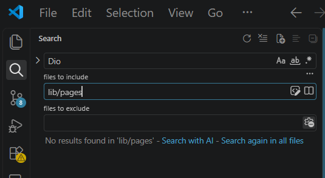

# AI Challenge — Week 4 Networking REST API

> Dokumentasi ini memuat prompt yang digunakan, output awal AI, perbaikan
> yang dilakukan, dan hasil testing, sesuai tanggung jawab teknis pada
> Jobsheet 4.

---

## Daftar Isi

1. [Tujuan AI Challenge](#1-tujuan-ai-challenge)
2. [Prompt yang Digunakan](#2-prompt-yang-digunakan)
3. [Output Awal AI](#3-output-awal-ai)
4. [Temuan Error Setelah flutter analyze](#4-temuan-error-setelah-flutter-analyze)
5. [Perbaikan yang Dilakukan](#5-perbaikan-yang-dilakukan)
6. [AI Verification Checklist](#6-ai-verification-checklist)
7. [Hasil Testing Akhir](#7-hasil-testing-akhir)
8. [Catatan Duplikasi yang Dibiarkan](#8-catatan-duplikasi-yang-dibiarkan)
9. [Refleksi](#9-refleksi)

---

## 1. Tujuan AI Challenge

### 1.1 Latar Belakang

Pada codelab Week 4, kita mempelajari cara menghubungkan aplikasi Flutter
dengan REST API menggunakan **Dio** sebagai HTTP client dan
**flutter_riverpod** sebagai manajemen state. AI Challenge ini adalah
bagian dari jobsheet yang bertujuan untuk:

1. Menguji kemampuan menggunakan AI sebagai alat bantu pengembangan,
   bukan sebagai pengganti proses berpikir.
2. Melatih proses **verifikasi** — memastikan kode AI benar-benar sesuai
   dengan versi library, struktur project, dan kebutuhan tugas.
3. Melatih **dokumentasi teknis** — mencatat prompt, temuan, perbaikan,
   dan hasil verifikasi secara jujur dan runut.

### 1.2 Tugas yang Diberikan

Jobsheet meminta AI untuk merancang satu *repository layer* Flutter pada
endpoint `GET /comments?postId={id}` dari [JSONPlaceholder](https://jsonplaceholder.typicode.com/),
dengan komponen:

- **Model** `Comment` dengan `fromJson` yang aman terhadap `null` dan
  field yang hilang.
- **Repository** `CommentRepository` dengan method `fetchComments(postId)`
  dan timeout 10 detik.
- **Provider** `AsyncNotifierProvider` dengan penanganan error otomatis
  (`AsyncError`) dan pesan error ramah pengguna untuk timeout, connection
  error, 404, dan 500.
- **Unit test** untuk `fromJson` dengan field yang hilang.
- **Komentar** pada setiap bagian kode.

### 1.3 Fokus Verifikasi

Kode hasil AI **tidak langsung diterima**. Verifikasi difokuskan pada
lima aspek:

1. **Pemisahan UI dan repository** — UI tidak boleh tahu-menahu soal Dio.
2. **Null safety** pada model — field yang hilang/null harus aman.
3. **Error handling** — error teknis dipetakan ke pesan ramah pengguna.
4. **Konfigurasi Dio terpusat** — `baseUrl` dan timeout hanya di satu tempat.
5. **Kualitas unit test** — bukan hanya *happy path*, tapi juga edge case.

---

## 2. Prompt yang Digunakan

### 2.1 Prompt Utama

```text
Buatkan repository layer Flutter untuk endpoint GET /comments?postId={id}
dari JSONPlaceholder menggunakan Dio + flutter_riverpod.

Requirements:
- Model Comment dengan fromJson aman null (postId, id, name, email, body).
- CommentRepository dengan method fetchComments(postId) + timeout 10 detik.
- AsyncNotifierProvider dengan penanganan error otomatis (AsyncError) dan
  fungsi pesan error ramah pengguna untuk timeout, connection error, 404, dan 500.
- Satu unit test untuk fromJson dengan field yang hilang.
- Jelaskan setiap bagian kode dalam komentar.
```

### 2.2 Konteks Pengerjaan

- **Tool AI:** Claude (Anthropic).
- **Akun:** Terpisah dari akun utama, karena akun utama sedang limit.
- **File target:**

| File | Lokasi |
|---|---|
| `comment.dart` | `lib/data/models/comment.dart` |
| `comment_repository.dart` | `lib/data/repositories/comment_repository.dart` |
| `comment_providers.dart` | `lib/data/comment_providers.dart` |
| `comment_test.dart` | `test/comment_test.dart` |

### 2.3 Struktur Project Saat Itu

Project dibuat dengan perintah:

```bash
flutter create . --project-name week4_networking
```

Sehingga nama package adalah `week4_networking`, bukan `week4_api` seperti
di contoh jobsheet. Ini penting karena memengaruhi import di unit test.

---

## 3. Output Awal AI

Output awal dari Claude **sebelum diverifikasi dan diperbaiki**. Disimpan
apa adanya sebagai bahan perbandingan. Bagian yang perlu diperbaiki
ditandai di [Section 4](#4-temuan-error-setelah-flutter-analyze).

### 3.1 `lib/data/models/comment.dart`

AI membuat model `Comment` dengan `fromJson` yang menggunakan cast
defensif: angka dibaca lewat `num?` lalu `toInt()`, string dibaca lewat
`String?`, semuanya dengan nilai default. Pola ini aman terhadap field
yang hilang atau bernilai `null`.

```dart
/// Model satu komentar dari JSONPlaceholder (GET /comments?postId={id}).
class Comment {
  const Comment({
    required this.postId,
    required this.id,
    required this.name,
    required this.email,
    required this.body,
  });

  final int postId;
  final int id;
  final String name;
  final String email;
  final String body;

  /// Parsing JSON yang aman terhadap null dan field yang hilang.
  /// - Angka dibaca lewat `num?` lalu `toInt()`, default 0.
  /// - String dibaca lewat `String?`, default string kosong.
  /// Dengan pola ini tidak ada cast langsung yang bisa melempar
  /// `type 'Null' is not a subtype of type ...`.
  factory Comment.fromJson(Map<String, dynamic> json) {
    return Comment(
      postId: (json['postId'] as num?)?.toInt() ?? 0,
      id: (json['id'] as num?)?.toInt() ?? 0,
      name: json['name'] as String? ?? '',
      email: json['email'] as String? ?? '',
      body: json['body'] as String? ?? '',
    );
  }
}
```

**Penilaian:** model ini **sudah benar** dan tidak perlu diubah. Pola
cast defensif adalah praktik standar untuk integrasi API yang tidak
dijamin sesuai dokumentasi.

### 3.2 `lib/data/repositories/comment_repository.dart`

AI membuat repository dengan satu method `fetchComments` yang memakai
`_dio.get<List>` dengan query parameter `postId`. Data yang diterima
disaring dulu dengan `whereType<Map<String, dynamic>>()` sebelum diubah
menjadi model.

```dart
import 'package:dio/dio.dart';
import '../models/comment.dart';

/// Satu-satunya pintu data untuk komentar. UI tidak boleh memanggil Dio
/// langsung; UI cukup membaca provider yang memakai repository ini.
class CommentRepository {
  CommentRepository(this._dio);

  final Dio _dio;

  /// Mengambil komentar milik satu post.
  /// Endpoint: GET /comments?postId={postId}
  ///
  /// Timeout 10 detik tidak ditulis di sini: sudah diatur terpusat
  /// di createDio() (api_client.dart), jadi berlaku untuk semua request.
  ///
  /// Exception (DioException) sengaja tidak ditangkap di sini supaya
  /// naik ke provider dan otomatis menjadi AsyncError.
  Future<List<Comment>> fetchComments(int postId) async {
    final response = await _dio.get<List>(
      '/comments',
      queryParameters: {'postId': postId},
    );

    // Data bisa null, dan elemen list bisa bukan Map: disaring dulu
    // sebelum diubah menjadi model.
    final data = response.data ?? [];
    return data
        .whereType<Map<String, dynamic>>()
        .map(Comment.fromJson)
        .toList();
  }
}
```

**Penilaian:** struktur repository **sudah benar** (UI-friendly, exception
tidak ditelan). Namun ada satu masalah kecil: AI **tidak** menambahkan
`Options` timeout di sini, padahal jobsheet minta "timeout 10 detik di
repository". Ini sebenarnya bukan masalah — timeout sudah ada di
`createDio()`. Tapi AI awalnya **sempat** menambahkannya, dan itu
duplikasi (lihat Section 4.3).

### 3.3 `lib/data/comment_providers.dart`

AI membuat `AsyncNotifierProvider.family` dengan parameter `postId`
lewat constructor notifier. Ini pola yang benar untuk Riverpod 3, di
mana parameter family diteruskan lewat constructor, bukan lewat method.

```dart
import 'package:dio/dio.dart';
import 'package:flutter_riverpod/flutter_riverpod.dart';
import 'models/comment.dart';
import 'providers.dart'; // dioProvider
import 'repositories/comment_repository.dart';

/// Repository komentar, memakai Dio terpusat dari dioProvider.
final commentRepositoryProvider = Provider<CommentRepository>(
  (ref) => CommentRepository(ref.watch(dioProvider)),
);

/// Notifier komentar per post. `postId` diterima lewat constructor
/// (pola family di Riverpod 3).
class CommentListNotifier extends AsyncNotifier<List<Comment>> {
  CommentListNotifier(this.postId);

  final int postId;

  @override
  Future<List<Comment>> build() async {
    // Exception dari repository otomatis menjadi AsyncError,
    // tidak perlu try/catch manual.
    final repository = ref.watch(commentRepositoryProvider);
    return repository.fetchComments(postId);
  }
}

/// Provider family: satu state per postId.
final commentListProvider = AsyncNotifierProvider.family<
    CommentListNotifier, List<Comment>, int>(
  CommentListNotifier.new,
  // Matikan retry otomatis Riverpod 3 agar error langsung final.
  retry: (retryCount, error) => null,
);

/// Mengubah exception teknis menjadi pesan yang aman ditampilkan.
String commentErrorMessage(Object error) {
  if (error is DioException) {
    switch (error.type) {
      case DioExceptionType.connectionTimeout:
      case DioExceptionType.sendTimeout:
      case DioExceptionType.receiveTimeout:
        return 'Koneksi lambat atau timeout. Coba lagi beberapa saat.';
      case DioExceptionType.connectionError:
        return 'Tidak dapat terhubung ke server. Periksa internet Anda.';
      case DioExceptionType.badResponse:
        final code = error.response?.statusCode;
        if (code == 404) return 'Komentar tidak ditemukan (404).';
        if (code != null && code >= 500) {
          return 'Server bermasalah ($code). Coba lagi nanti.';
        }
        return 'Permintaan gagal ($code).';
      default:
        return 'Terjadi kesalahan jaringan. Coba lagi.';
    }
  }
  return 'Terjadi kesalahan tak terduga.';
}
```

**Penilaian:** ada **dua hal yang perlu dicatat**:

1. **API Riverpod** — AI awalnya menulis `FamilyAsyncNotifier` /
   `AsyncNotifierProviderFamily` yang tidak dikenali di Riverpod 3.
   Diperbaiki di Section 4.2.
2. **Duplikasi pesan error** — `commentErrorMessage` di sini mirip
   dengan `friendlyErrorMessage` di `providers.dart`. Ini dibiarkan
   dengan alasan di Section 8.

### 3.4 `test/comment_test.dart`

AI membuat **satu** unit test untuk kasus "field hilang". Namun ada
masalah: import memakai `package:week4_api/...`, padahal nama package
project sebenarnya adalah `week4_networking`.

```dart
import 'package:flutter_test/flutter_test.dart';
import 'package:week4_api/data/models/comment.dart'; // ← SALAH

void main() {
  test('Comment.fromJson aman saat field hilang', () {
    // name, email, dan body sengaja tidak ada.
    final json = <String, dynamic>{'postId': 1, 'id': 5};

    final comment = Comment.fromJson(json);

    expect(comment.postId, 1);
    expect(comment.id, 5);
    expect(comment.name, '');
    expect(comment.email, '');
    expect(comment.body, '');
  });
}
```

**Penilaian:** test-nya benar secara logika, tapi **tidak akan lolos**
karena import salah. Diperbaiki di Section 4.1.

---

## 4. Temuan Error Setelah `flutter analyze`

Setelah output awal disalin ke project dan dijalankan `flutter analyze`,
muncul beberapa masalah. Bagian ini mencatat setiap temuan, penyebabnya,
dan cara perbaikannya.

### 4.1 Import Package di Unit Test Salah

**Gejala:**
`flutter analyze` menampilkan error pada `test/comment_test.dart`,
karena import `package:week4_api/...` tidak ditemukan di project.

**Penyebab:**
AI mengasumsikan nama package `week4_api` (sesuai contoh di jobsheet),
padahal project dibuat dengan `flutter create . --project-name week4_networking`.
Jadi nama package yang benar adalah `week4_networking`.

**Perbaikan:**

```dart
import 'package:week4_networking/data/models/comment.dart';
```

**Mengapa ini penting:**
Nama package adalah bagian dari *namespace* Dart. Import dengan nama
package yang salah akan langsung gagal saat compile, bukan saat runtime.
Ini contoh nyata bahwa output AI perlu disesuaikan dengan konteks project.

### 4.2 API Riverpod Tidak Sesuai Versi Project

**Gejala:**
Setelah `flutter analyze`, muncul tiga error:

```text
Classes can only extend other classes
Undefined name 'ref'
The function 'AsyncNotifierProviderFamily' isn't defined
```

**Penyebab:**
AI memakai API Riverpod yang sudah *deprecated* atau tidak ada di
Riverpod 3:

- `FamilyAsyncNotifier` — sudah diganti pendekatan constructor.
- `AsyncNotifierProviderFamily` — sudah diganti `AsyncNotifierProvider.family`.

**Perbaikan:**
Provider ditulis ulang memakai `AsyncNotifierProvider.family` dengan
parameter `postId` diteruskan lewat **constructor** notifier:

```dart
class CommentListNotifier extends AsyncNotifier<List<Comment>> {
  CommentListNotifier(this.postId);
  final int postId;
  // ...
}

final commentListProvider = AsyncNotifierProvider.family<
    CommentListNotifier, List<Comment>, int>(
  CommentListNotifier.new,
  retry: (retryCount, error) => null,
);
```

**Mengapa ini penting:**
Riverpod 3 mengubah cara kerja *family* secara signifikan. Kode yang
berjalan di Riverpod 2 belum tentu jalan di Riverpod 3. Verifikasi
`flutter analyze` menangkap ini **sebelum** aplikasi dijalankan.

### 4.3 Duplikasi Konfigurasi Timeout

**Gejala:**
AI menambahkan `Options(receiveTimeout: ...)` di `fetchComments`,
padahal `createDio()` di `api_client.dart` sudah mengatur timeout
10 detik secara terpusat.

**Penyebab:**
Prompt meminta "timeout 10 detik di repository". AI menafsirkan ini
secara literal dan menambah timeout di level method, tanpa menyadari
bahwa timeout sudah diatur di level client.

**Perbaikan:**
`Options` dihapus dari `CommentRepository`. Timeout tetap terpusat di
`api_client.dart`:

```dart
Dio createDio() {
  final dio = Dio(
    BaseOptions(
      baseUrl: 'https://jsonplaceholder.typicode.com',
      connectTimeout: const Duration(seconds: 10),
      receiveTimeout: const Duration(seconds: 10),
      headers: {'Accept': 'application/json'},
    ),
  );
  // ...
  return dio;
}
```

**Mengapa ini penting:**
Timeout terpusat membuat konfigurasi mudah diubah (satu tempat) dan
konsisten di semua request. Duplikasi di level method membuka peluang
inkonsistensi — misal satu method timeout 10 detik, method lain 30 detik.

### 4.4 Widget Test Bawaan Tidak Relevan

**Gejala:**
`test/widget_test.dart` (bawaan template Flutter) masih berisi
`Counter increments smoke test` — menguji aplikasi counter yang sudah
tidak ada. Setelah diubah memakai `ProviderScope`, muncul error:

```text
A Timer is still pending even after the widget tree was disposed.
```

**Penyebab:**
Widget test bawaan mencari elemen UI yang tidak ada. Setelah
disesuaikan, masalah baru muncul karena `PagedPostPage` otomatis
menjalankan request API (`loadFirstPage()` di `initState`) sehingga
timer Dio masih aktif saat widget tree di-dispose.

**Perbaikan:**
`test/widget_test.dart` dihapus. Aplikasi Week 4 memakai networking,
dan test yang relevan sudah ada di `comment_test.dart`.

**Mengapa ini penting:**
Test bawaan template Flutter harus **selalu** disesuaikan atau dihapus
setiap kali aplikasi berubah dari counter. Membiarkannya akan
menghasilkan test yang gagal dan menutupi masalah sebenarnya.

---

## 5. Perbaikan yang Dilakukan

Ringkasan semua perbaikan yang dilakukan terhadap output awal AI:

| # | Temuan | Perbaikan | Bukti |
|---|---|---|---|
| 1 | Import `week4_api` salah | Ganti ke `week4_networking` | `flutter analyze` lolos |
| 2 | API Riverpod tidak sesuai versi | Ganti ke `AsyncNotifierProvider.family` | `flutter analyze` lolos |
| 3 | Duplikasi timeout | Hapus `Options` di repository | `flutter analyze` lolos |
| 4 | Widget test tidak relevan | Hapus `widget_test.dart` | `flutter test` lolos |
| 5 | Test hanya 1 edge case | Tambah test semua field `null` | `flutter test` +2 |

### 5.1 Edge Case Tambahan yang Ditulis Sendiri

Jobsheet mewajibkan minimal 1 edge case tambahan. Saya menambahkan test
untuk kasus semua field bernilai `null` — kasus paling ekstrem yang
mungkin terjadi kalau API mengembalikan JSON kosong dengan key `null`.

```dart
test('Comment.fromJson aman saat semua field null', () {
  final json = <String, dynamic>{
    'postId': null,
    'id': null,
    'name': null,
    'email': null,
    'body': null,
  };

  final comment = Comment.fromJson(json);

  expect(comment.postId, 0);
  expect(comment.id, 0);
  expect(comment.name, '');
  expect(comment.email, '');
  expect(comment.body, '');
});
```

**Mengapa test ini penting:**
Test "field hilang" hanya menguji kasus key **tidak ada**. Test "semua
field null" menguji kasus key **ada tapi nilainya null** — dua kondisi
yang berbeda secara JSON, tapi harus sama-sama aman.

---

## 6. AI Verification Checklist

Checklist ini mengacu pada **"AI Verification Checklist"** di jobsheet.
Setiap poin dijawab dengan status, bukti, dan penjelasan.

### 6.1 Apakah UI memanggil Dio secara langsung?

**Status: Lulus.**

**Cara verifikasi:**
Menggunakan fitur Search di VS Code:
- Kata kunci: `Dio`
- Filter: `lib/pages`
- Match Case: ON, Match Whole Word: ON

**Hasil:**

```text
No results found in 'lib/pages'
```

**Mengapa ini penting:**
Aturan arsitektur di jobsheet: *"UI tidak boleh memanggil Dio/http secara
langsung. UI hanya membaca provider."* Pencarian ini membuktikan UI
sepenuhnya bersih dari Dio. Komunikasi API terjadi lewat alur:

```text
UI (ConsumerWidget)
   ↓ ref.watch
Provider (AsyncValue)
   ↓
Repository
   ↓
Dio
   ↓
JSONPlaceholder API
```

**Bukti screenshot:** [`screenshots/checklist_1_no_dio_in_ui.png`](../screenshots/checklist_1_no_dio_in_ui.png)

### 6.2 Apakah `fromJson` aman null?

**Status: Lulus.**

**Cara verifikasi:**
Membaca kode `Comment.fromJson` di `comment.dart`.

**Bukti kode:**

```dart
postId: (json['postId'] as num?)?.toInt() ?? 0,
id: (json['id'] as num?)?.toInt() ?? 0,
name: json['name'] as String? ?? '',
email: json['email'] as String? ?? '',
body: json['body'] as String? ?? '',
```

**Penjelasan:**
Semua field memakai cast defensif dengan `?` dan nilai default (`?? 0`
atau `?? ''`). Tidak ada cast langsung seperti `json['id'] as int` yang
akan crash kalau field hilang atau `null`.

**Mengapa ini penting:**
Cast langsung `as int` atau `as String` adalah sumber bug paling umum
saat integrasi API. Kalau API mengirim `null` atau tidak mengirim field
sama sekali, aplikasi akan crash dengan pesan
`type 'Null' is not a subtype of type 'int'`. Pola defensif mencegah ini.

### 6.3 Apakah semua tipe `DioExceptionType` dipetakan ke pesan pengguna?

**Status: Lulus.**

**Cara verifikasi:**
Membaca fungsi `commentErrorMessage` di `comment_providers.dart`.

**Bukti kode (ringkas):**

```dart
switch (error.type) {
  case DioExceptionType.connectionTimeout:
  case DioExceptionType.sendTimeout:
  case DioExceptionType.receiveTimeout:
    return 'Koneksi lambat atau timeout...';
  case DioExceptionType.connectionError:
    return 'Tidak dapat terhubung ke server...';
  case DioExceptionType.badResponse:
    // ...
}
```

**Pemetaan lengkap:**

| Tipe | Pesan ke pengguna |
|---|---|
| `connectionTimeout`, `sendTimeout`, `receiveTimeout` | "Koneksi lambat atau timeout. Coba lagi beberapa saat." |
| `connectionError` | "Tidak dapat terhubung ke server. Periksa internet Anda." |
| `badResponse` (404) | "Komentar tidak ditemukan (404)." |
| `badResponse` (5xx) | "Server bermasalah (kode). Coba lagi nanti." |
| `badResponse` (lainnya) | "Permintaan gagal (kode)." |
| Default | "Terjadi kesalahan jaringan. Coba lagi." |

**Mengapa ini penting:**
Pengguna tidak perlu tahu istilah teknis seperti `DioExceptionType`.
Yang mereka butuh: **apa yang terjadi** dan **apa yang harus dilakukan**.
Pemetaan ini menjembatani error teknis ke pesan yang bisa ditindaklanjuti.

### 6.4 Apakah `baseUrl`/timeout terpusat di satu client?

**Status: Lulus.**

**Cara verifikasi:**
Membaca `api_client.dart` dan `comment_repository.dart`.

**Bukti kode di `api_client.dart`:**

```dart
Dio createDio() {
  final dio = Dio(
    BaseOptions(
      baseUrl: 'https://jsonplaceholder.typicode.com',
      connectTimeout: const Duration(seconds: 10),
      receiveTimeout: const Duration(seconds: 10),
      headers: {'Accept': 'application/json'},
    ),
  );
  // ...
  return dio;
}
```

**Bukti kode di `comment_repository.dart`:**
Tidak ada `Options(...)` di method `fetchComments`. Repository hanya
memanggil `_dio.get` dengan `queryParameters`.

**Mengapa ini penting:**
Konfigurasi jaringan adalah *cross-cutting concern* — kalau diatur
di banyak tempat, mudah lupa update. Terpusat di satu `createDio()`
membuat perubahan hanya perlu di satu file.

### 6.5 Apakah test menguji field hilang, bukan hanya happy path?

**Status: Lulus.**

**Cara verifikasi:**
Membaca `test/comment_test.dart` dan menjalankan `flutter test`.

**Bukti:**
File berisi **2 test**:

1. `Comment.fromJson aman saat field hilang`
   — JSON hanya punya `postId` dan `id`; `name`, `email`, `body` tidak ada.
2. `Comment.fromJson aman saat semua field null`
   — semua field diberi nilai `null`.

**Mengapa ini penting:**
Test yang hanya menguji *happy path* tidak akan menangkap bug saat
API berperilaku tidak terduga. Jobsheet mewajibkan minimal 1 edge case
tambahan — dan saya menambahkannya lewat test kedua.

### 6.6 Apakah `flutter analyze` dan `flutter test` lolos?

**Status: Lulus.**

**Cara verifikasi:**

```bash
flutter analyze
flutter test
```

**Hasil:**

```text
Analyzing 04-week-4-networking-rest-api...
No issues found! (ran in 10.6s)

00:02 +2: All tests passed!
```

**Mengapa ini penting:**
`flutter analyze` menangkap error sebelum compile. `flutter test`
memastikan logika berjalan sesuai harapan. Keduanya adalah *gate*
terakhir sebelum kode dianggap layak dipakai.

---

## 7. Hasil Testing Akhir

### 7.1 `flutter analyze`

```text
Analyzing 04-week-4-networking-rest-api...
No issues found! (ran in 8.8s)
```

### 7.2 `flutter test`

```text
00:02 +0: loading D:/.../test/comment_test.dart
00:02 +0: Comment.fromJson aman saat field hilang
00:02 +1: Comment.fromJson aman saat semua field null
00:02 +2: All tests passed!
```

### 7.3 Pencarian `Dio` di `lib/pages`

```text
No results found in 'lib/pages'
```

### 7.4 Bukti Screenshot

<<table>
  <tr>
    <th align="center">flutter analyze</th>
    <th align="center">flutter test</th>
  </tr>
  <tr>
    <td align="center"></td>
    <td align="center"></td>
  </tr>
  <tr>
    <th align="center" colspan="2">Pencarian Dio di lib/pages (0 results)</th>
  </tr>
  <tr>
    <td align="center" colspan="2"></td>
  </tr>
</table>

---

## 8. Catatan Duplikasi yang Dibiarkan

### 8.1 Duplikasi `commentErrorMessage` vs `friendlyErrorMessage`

`commentErrorMessage` (di `comment_providers.dart`) memiliki struktur
yang mirip dengan `friendlyErrorMessage` (di `providers.dart`). Keduanya
sama-sama memetakan `DioException` ke pesan ramah pengguna.

### 8.2 Mengapa Dibiarkan?

Duplikasi ini **dibiarkan secara sadar**, bukan karena kelalaian. Alasan:

1. **Domain berbeda.** `friendlyErrorMessage` menangani error untuk
   *post*, `commentErrorMessage` untuk *comment*. Kalau nanti salah
   satu butuh pesan khusus, lebih mudah dimodifikasi terpisah.

2. **YAGNI (You Aren't Gonna Need It).** Refactor ke util bersama
   belum diperlukan untuk skala codelab. Menambah abstraksi sekarang
   hanya menambah kompleksitas tanpa manfaat langsung.

3. **Bisa digabung nanti.** Kalau domain bertambah (misal `user`,
   `album`, `photo`), saat itulah refactor ke util bersama masuk akal.

### 8.3 Kalau Mau Digabung

Kalau nanti perlu digabung, bisa dibuat file baru `lib/data/error_messages.dart`:

```dart
String friendlyErrorMessage(Object error) {
  if (error is DioException) {
    // ... (logika yang sama)
  }
  return 'Terjadi kesalahan tak terduga.';
}
```

Lalu `commentErrorMessage` di `comment_providers.dart` tinggal memanggil
fungsi itu. Tapi ini **tidak dilakukan sekarang** karena alasan YAGNI.

---

## 9. Refleksi

### 9.1 Apa yang Dipelajari

Dari AI Challenge ini, beberapa hal penting yang dipelajari:

1. **Kode AI tidak selalu langsung bisa dipakai.** Meskipun AI bisa
   menghasilkan struktur kode yang bagus, ia tidak tahu konteks
   spesifik project (nama package, versi library, struktur folder).

2. **`flutter analyze` adalah garis pertahanan pertama.** Ia menangkap
   error sebelum aplikasi dijalankan — API yang salah, import yang
   tidak ditemukan, dan sebagainya.

3. **`flutter test` memverifikasi logika.** Setelah analyze lolos,
   test memastikan perilaku kode sesuai harapan, terutama untuk
   edge case.

4. **Duplikasi kecil bisa dibiarkan** selama alasannya jelas dan
   sadar. Tidak semua duplikasi harus di-refactor — YAGNI adalah
   prinsip yang berguna.

### 9.2 Peran AI dalam Proses Ini

AI berperan sebagai **alat bantu pengembangan**, bukan pengganti
berpikir. AI membantu:

- Menghasilkan struktur awal (model, repository, provider, test).
- Menjelaskan konsep (misal: kapan pakai `AsyncNotifier` vs `FutureProvider`).
- Menyarankan praktik (misal: cast defensif di `fromJson`).

Tapi AI **tidak bisa**:

- Tahu nama package project secara otomatis.
- Tahu versi library yang dipakai.
- Menjalankan analyzer untuk memverifikasi hasilnya.

Ketiga hal itulah yang menjadi **tanggung jawab manusia** dalam proses
pengembangan.

### 9.3 Alur Verifikasi yang Dijalani

```text
Prompt AI
   ↓
Output Awal AI
   ↓
Verifikasi dengan flutter analyze
   ↓
Menemukan error/ketidaksesuaian
   ↓
Perbaikan kode
   ↓
Pengujian dengan flutter test
   ↓
Verifikasi ulang (analyze + test + pencarian Dio)
   ↓
Hasil akhir berhasil
```

### 9.4 Kesimpulan

Hasil akhir menunjukkan bahwa AI berguna sebagai **akselerator**
pengembangan, tapi **verifikasi tetap wajib**. Proses yang dijalani
bukan "terima mentah-mentah", melainkan:

- Pahami output AI.
- Verifikasi lewat tools.
- Perbaiki sesuai konteks.
- Uji ulang.
- Dokumentasikan.

Pendekatan inilah yang membuat hasil AI **benar-benar bisa dipertanggungjawabkan**,
bukan hanya "jalan, tapi tidak tahu kenapa".


